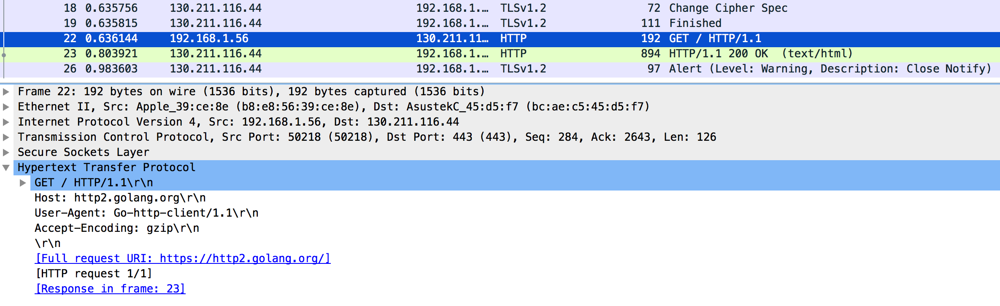
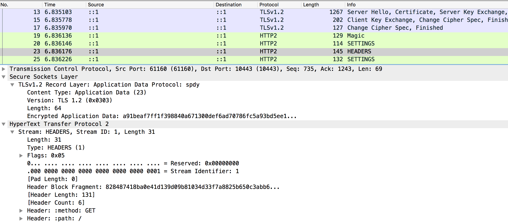

# Go crypto/tls SSL key log Proof of Concept

With [a very simple modification](https://github.com/joneskoo/http2-keylog/commit/d75943121890354e1d9c4eed1bb7281e5eb95761) to crypto/tls we can dump
TLS secrets in a format Wireshark can import. This makes
debugging TLS application issues much easier!

Issue: [golang/go #13057 crypto/tls: support NSS-formatted key log file](https://github.com/golang/go/issues/13057)

## Client dump

```bash
$ go build client.go
$ ./client https://http2.golang.org/
2016/07/12 23:45:47 &{200 OK 200 HTTP/1.1 1 1 map[Date:[Tue, 12 Jul 2016 20:45:47 GMT] Content-Length:[682] Content-Type:[text/html; charset=utf-8]] 0xc820322080 682 [] false map[] 0xc8200c8000 0xc820244370}
```

```bash
# SSL/TLS secrets log file, generated by go
CLIENT_RANDOM b45c940d802822fd04c85a38b03b7227168457fbadb8be57a0f9cd05c4a0d2d3 6cbdd6f6bcdc5c3d7df7f0074b481eec649002ec64e2cfd91255e346aab617e72a1da2668176216e1d03f70505a335eb
```



## Server dump

```bash
$ go run vendor/crypto/tls/generate_cert.go -host localhost
2016/07/10 09:51:45 written cert.pem
2016/07/10 09:51:45 written key.pem
$ go build server.go
$ ./server
2016/07/12 23:29:07 Listening at https://[::1]:10443/
2016/07/12 23:29:07 Leaking TLS keys to ssl-keylog.txt
```

Meanwhile in another terminal

```bash
$ curl -k 'https://[::1]:10443/'
This is an example server.
```

Now the test server dumps client random and TLS master secret to a file

```bash
# SSL/TLS secrets log file, generated by go
CLIENT_RANDOM 5781f0898847c3eeea2f5b51b531d9b14f76bc1fd23af2e3896b7871d022e1ad c4dec1b90c263251ae38be20b54e2e7f861c4953042f4fd8a14bcc8c60a86691eb6bb6073e45258e7bfbade1e984987a
```

Boom, TLS decrypted in Wireshark!


